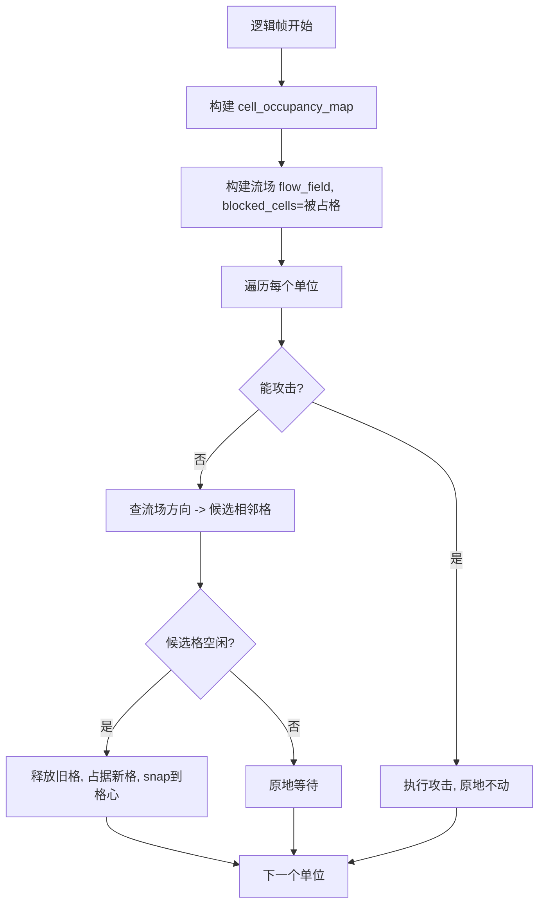

# M4 严格六角格战斗修正文档

> **目标**：战斗阶段所有单位严格遵循六角格规则——每个单位只能占据一个格子，每个格子最多容纳一个单位，已占格子阻挡其他单位通行和移动。

---

## 一、当前问题

从截图可以清楚看到：多个单位堆叠在同一位置，完全没有遵守六角格约束。

### 根因分析

| # | 根因 | 位置 | 说明 |
|---|------|------|------|
| 1 | **移动是像素级连续移动，不是格子到格子** | `unit_movement.gd` L60 | `set_flow_direction()` 用 `position + direction * step_distance` 算目标点，单位在像素空间自由滑动，不吸附到格心 |
| 2 | **没有格子占用表** | `combat_manager.gd` | 整个战斗管理器没有维护"哪个格子被谁占了"的 Dictionary，无法阻止多单位进同一格 |
| 3 | **流场不考虑已占用格子** | `combat_manager.gd` L350 | `_rebuild_flow_fields()` 调用 `FlowField.build()` 时 `blocked_cells` 参数传空 `{}`，已有单位的格子不会被标记为障碍 |
| 4 | **攻击范围判定用像素距离** | `combat_manager.gd` L432-443 | `_is_target_in_attack_range()` 用 `distance_squared_to()` 做像素距离判断，不是格子距离 |

### 当前代码要害引用

**unit_movement.gd** — 连续像素移动：
```gdscript
# L58-61: 目标 = 当前位置 + 方向 * 像素步长（不是格心坐标）
var unit_node: Node2D = owner_unit as Node2D
move_target = unit_node.position + _flow_direction * _flow_step_distance
has_target = true

# L89-91: 每帧沿方向做像素级位移
var step: float = move_speed * delta
var direction: Vector2 = to_target / maxf(distance, 0.0001)
unit_node.position += direction * minf(step, distance)
```

**combat_manager.gd** — 流场不阻挡已占格子：
```gdscript
# L350-351: blocked_cells 永远为空
_flow_to_enemy.build(_hex_grid, ally_targets, {})
_flow_to_ally.build(_hex_grid, enemy_targets, {})
```

---

## 二、修正方案总览

### 核心思路

```
当前：单位在像素空间自由移动，位置是任意 Vector2
修正后：单位永远处于某个六角格中心，移动 = 从当前格跳到相邻格
```



---

## 三、需要新增的数据结构

### 3.1 格子占用表 `_cell_occupancy`（在 `combat_manager.gd` 中）

```gdscript
# 新增成员变量
var _cell_occupancy: Dictionary = {}  # int(cell_key) -> int(unit_instance_id)
var _unit_cell: Dictionary = {}       # int(unit_instance_id) -> Vector2i(当前所在格)
```

**API 列表：**

| 函数 | 说明 |
|------|------|
| `_occupy_cell(cell: Vector2i, unit: Node)` | 将 unit 注册到 cell，同时更新 `_unit_cell` |
| `_vacate_cell(cell: Vector2i)` | 清空 cell 的占用 |
| `_vacate_unit(unit: Node)` | 根据 unit 找到其所在 cell 并释放 |
| `_is_cell_free(cell: Vector2i) -> bool` | 检查 cell 是否无人占用 |
| `_get_unit_cell(unit: Node) -> Vector2i` | 返回 unit 当前所在格 |
| `_build_blocked_cells() -> Dictionary` | 遍历 `_cell_occupancy` 生成流场阻挡表 |

---

## 四、各文件具体修改

### 4.1 `combat_manager.gd` —— 核心改造（改动量最大）

#### 4.1.1 新增 `_cell_occupancy` 和 `_unit_cell`

在类顶部声明：
```gdscript
var _cell_occupancy: Dictionary = {}  # cell_key_int -> unit_instance_id
var _unit_cell: Dictionary = {}       # unit_instance_id -> Vector2i
```

在 `_reset_battle_runtime_state()` 中清空：
```gdscript
_cell_occupancy.clear()
_unit_cell.clear()
```

#### 4.1.2 修改 `_register_units()` — 注册时占格

在每个单位注册后，将其 `deployed_cell` 对应格子标记为占用：

```gdscript
# 在 _register_units() 末尾对每个 unit 补充：
var cell: Vector2i = _hex_grid.call("world_to_axial", unit.position)
_occupy_cell(cell, unit)
# 确保单位 position 吸附到格心
unit.position = _hex_grid.call("axial_to_world", cell)
```

#### 4.1.3 修改 `_rebuild_flow_fields()` — 传入阻挡表

```diff
 func _rebuild_flow_fields() -> void:
     if _hex_grid == null:
         return
+    var blocked: Dictionary = _build_blocked_cells()
     var ally_targets: Array[Vector2i] = []
     var enemy_targets: Array[Vector2i] = []
     for cell in _team_cells_cache.get(TEAM_ENEMY, []):
         ally_targets.append(cell)
     for cell in _team_cells_cache.get(TEAM_ALLY, []):
         enemy_targets.append(cell)
-    _flow_to_enemy.build(_hex_grid, ally_targets, {})
-    _flow_to_ally.build(_hex_grid, enemy_targets, {})
+    _flow_to_enemy.build(_hex_grid, ally_targets, blocked)
+    _flow_to_ally.build(_hex_grid, enemy_targets, blocked)
```

> **注意**：`_build_blocked_cells()` 应该排除目标格本身（即敌方所在格不该被己方流场标记为 blocked，否则流场会绕开敌人而不是走向敌人）。方法是：为己方流场只 block 己方单位所在格，为敌方流场只 block 敌方单位所在格。

```gdscript
func _build_blocked_cells_for_team(self_team: int) -> Dictionary:
    var blocked: Dictionary = {}
    for raw_key in _cell_occupancy.keys():
        var cell_key: int = int(raw_key)
        var iid: int = int(_cell_occupancy[cell_key])
        if not _unit_by_instance_id.has(iid):
            continue
        var unit: Node = _unit_by_instance_id[iid]
        # 只阻挡同队友方格子（己方不能走到己方格子上，但要能走向敌方格子）
        if int(unit.get("team_id")) == self_team:
            blocked[cell_key] = true
    return blocked
```

修改 `_rebuild_flow_fields`：
```gdscript
var blocked_for_ally: Dictionary = _build_blocked_cells_for_team(TEAM_ALLY)
var blocked_for_enemy: Dictionary = _build_blocked_cells_for_team(TEAM_ENEMY)
_flow_to_enemy.build(_hex_grid, ally_targets, blocked_for_ally)
_flow_to_ally.build(_hex_grid, enemy_targets, blocked_for_enemy)
```

#### 4.1.4 修改 `_run_unit_logic()` — 格子到格子移动

将当前的"采样流场方向 → 设置像素目标"改为"采样流场 → 找到最佳相邻格 → 检查是否空闲 → 占据新格"：

```gdscript
func _run_unit_logic(unit: Node, delta: float) -> void:
    if not _battle_running or not _is_live_unit(unit) or not _is_unit_alive(unit):
        return
    var combat: Node = _get_combat(unit)
    if combat == null:
        return
    combat.call("tick_logic", delta)

    var target: Node = _pick_target_for_unit(unit)

    # 攻击判定（改用格子距离）
    if _try_execute_attack(unit, combat, target):
        return

    # 移动判定：找到流场建议的下一个格子
    var current_cell: Vector2i = _get_unit_cell(unit)
    var best_next: Vector2i = _pick_best_adjacent_cell(unit, current_cell)

    if best_next == current_cell:
        # 无可用格子，原地等待
        var movement: Node = _get_movement(unit)
        if movement != null:
            movement.call("clear_target")
        unit.call("play_anim_state", 0, {})  # IDLE
        return

    # 执行格子移动
    _vacate_cell(current_cell)
    _occupy_cell(best_next, unit)
    var movement: Node = _get_movement(unit)
    if movement != null:
        var target_world: Vector2 = _hex_grid.call("axial_to_world", best_next)
        movement.call("set_target", target_world)
    unit.call("play_anim_state", 1, {})  # MOVE
```

#### 4.1.5 新增 `_pick_best_adjacent_cell()` — 选择最佳相邻空闲格

```gdscript
func _pick_best_adjacent_cell(unit: Node, current_cell: Vector2i) -> Vector2i:
    var team_id: int = int(unit.get("team_id"))
    var flow_field: FlowField = _flow_to_enemy if team_id == TEAM_ALLY else _flow_to_ally
    var current_cost: int = flow_field.sample_cost(current_cell)

    var best_cell: Vector2i = current_cell
    var best_cost: int = current_cost

    for dir in FlowField.AXIAL_DIRS:
        var neighbor: Vector2i = current_cell + dir
        if not bool(_hex_grid.call("is_inside_grid", neighbor)):
            continue
        var neighbor_key: int = _cell_key_int(neighbor)

        # 检查是否有敌方目标在此格（允许走向敌人攻击）
        var neighbor_occupied_by_enemy: bool = false
        if _cell_occupancy.has(neighbor_key):
            var occupant_id: int = int(_cell_occupancy[neighbor_key])
            if _unit_by_instance_id.has(occupant_id):
                var occupant: Node = _unit_by_instance_id[occupant_id]
                if int(occupant.get("team_id")) != team_id:
                    neighbor_occupied_by_enemy = true

        # 格子被同队占据 → 跳过
        if _cell_occupancy.has(neighbor_key) and not neighbor_occupied_by_enemy:
            continue

        # 敌方格子可以走向但不要真的走进去（停在旁边打）
        if neighbor_occupied_by_enemy:
            continue

        var neighbor_cost: int = flow_field.sample_cost(neighbor)
        if neighbor_cost < 0:
            continue  # 流场不可达
        if neighbor_cost < best_cost:
            best_cost = neighbor_cost
            best_cell = neighbor

    return best_cell
```

#### 4.1.6 修改 `_is_target_in_attack_range()` — 改用格子距离

```diff
 func _is_target_in_attack_range(attacker: Node, target: Node) -> bool:
     var combat: Node = _get_combat(attacker)
     if combat == null:
         return false
-    var hex_size: float = 26.0
-    if _hex_grid != null:
-        hex_size = float(_hex_grid.get("hex_size"))
-    var world_range: float = float(combat.call("get_attack_range_world", hex_size))
-    var dist_sq: float = attacker.position.distance_squared_to(target.position)
-    return dist_sq <= world_range * world_range
+    var attacker_cell: Vector2i = _get_unit_cell(attacker)
+    var target_cell: Vector2i = _get_unit_cell(target)
+    var hex_dist: int = _hex_distance(attacker_cell, target_cell)
+    var range_cells: int = maxi(int(combat.call("get_attack_range_cells")), 1)
+    return hex_dist <= range_cells
```

新增 `_hex_distance()` 工具函数：

```gdscript
func _hex_distance(a: Vector2i, b: Vector2i) -> int:
    # 轴坐标六角距离公式：(|dq| + |dq+dr| + |dr|) / 2
    var dq: int = b.x - a.x
    var dr: int = b.y - a.y
    return (absi(dq) + absi(dq + dr) + absi(dr)) / 2
```

#### 4.1.7 修改 `_handle_unit_death()` — 死亡时释放格子

```diff
 func _handle_unit_death(dead_unit: Node, killer: Node) -> void:
     ...
     _dead_registry[dead_id] = true
+    _vacate_unit(dead_unit)
     dead_unit.call("play_anim_state", 5, {})
     ...
```

---

### 4.2 `unit_movement.gd` —— 简化为目标点吸附

移动组件改为：只接受一个目标世界坐标（格心），进行平滑移动，到达后吸附。

**需要修改的方法：**

| 方法 | 修改 |
|------|------|
| `set_flow_direction()` | **删除**或标记废弃，改由 `combat_manager` 直接用 `set_target(world_pos)` 设定格心坐标 |
| `tick()` | **保持不变**，它已经正确地做像素平滑移动到 `move_target` 并在到达后停止 |

```diff
 # 删除 set_flow_direction()，改为由 combat_manager 调用 set_target() 传入格心坐标
-func set_flow_direction(direction: Vector2, step_distance: float = 28.0) -> void:
-    ...
-    move_target = unit_node.position + _flow_direction * _flow_step_distance
-    has_target = true
+# [已废弃] 格子化移动后，combat_manager 直接调用 set_target(格心坐标)
```

> `tick()` 中的平滑移动逻辑**保留**。这样单位在格子间移动时仍有视觉平滑过渡，但逻辑上每帧只在一个格子。

---

### 4.3 `unit_combat.gd` —— 新增格子距离版攻击范围

```gdscript
func get_attack_range_cells() -> int:
    # 返回格子数（整数），1 = 近战（只能打相邻格），2+ = 远程
    return maxi(int(_get_owner_stat("rng")), 1)
```

原有 `get_attack_range_world()` **保留**不删，但战斗管理器不再调用它。

---

### 4.4 `flow_field.gd` —— 无需修改

`FlowField.build()` 已经支持 `blocked_cells: Dictionary` 参数，只是当前调用方传的是空字典。修正后由 `combat_manager` 传入占用表即可。

### 4.5 `hex_grid.gd` —— 无需修改

坐标转换逻辑已经完整，六角距离计算放在 `combat_manager` 中即可。

### 4.6 `spatial_hash.gd` —— 可保留，角色不变

SpatialHash 仍可用于 tooltip 拾取等 UI 功能，战斗寻敌改用 `_cell_occupancy` + 流场。

---

## 五、涉及文件变更总览

| 文件 | 改动级别 | 说明 |
|------|----------|------|
| `scripts/combat/combat_manager.gd` | **大改** | 新增占用表、修改移动逻辑为格子级、修改攻击距离判定、流场传入阻挡表 |
| `scripts/unit/unit_movement.gd` | **小改** | 删除 `set_flow_direction()`，只保留 `set_target()` + `tick()` |
| `scripts/unit/unit_combat.gd` | **小改** | 新增 `get_attack_range_cells()` |
| `scripts/combat/flow_field.gd` | 不改 | 已支持 blocked_cells |
| `scripts/board/hex_grid.gd` | 不改 | — |
| `scripts/board/spatial_hash.gd` | 不改 | 保留用于 UI 拾取 |
| `scripts/battle/battlefield_runtime.gd` | **微调** | 部署单位时调用 `_occupy_cell`（如果 combat_manager 暴露了接口） |

---

## 六、关键约束与边界条件

### 6.1 移动行为约束

| 约束 | 实现方式 |
|------|----------|
| 每格最多1个单位 | `_cell_occupancy` 字典只存一个 unit_id |
| 单位只能移动到相邻6格之一 | `_pick_best_adjacent_cell()` 只遍历 `AXIAL_DIRS` 6个方向 |
| 被占格不可移入 | 检查 `_cell_occupancy.has(neighbor_key)` |
| 己方格阻挡己方 | 流场 `blocked_cells` 包含同队占用格 |
| 敌方格不阻挡寻路但不可移入 | 流场不 block 敌方格，但 `_pick_best_adjacent_cell()` 不允许走进去 |
| 死亡单位释放格子 | `_handle_unit_death()` 调用 `_vacate_unit()` |

### 6.2 攻击距离约束

| 角色类型 | rng 值 | 含义 |
|----------|--------|------|
| 近战 | 1 | 只能攻击相邻六格内的敌人 |
| 中程 | 2 | 能攻击 2 格距离内的敌人 |
| 远程 | 3+ | 能攻击 3+ 格距离内的敌人 |

### 6.3 移动时序

每个逻辑帧内，单位按 `_all_units` 数组顺序依次决策移动。先移动的单位优先占格。为避免结果取决于数组顺序导致不公平：

- **建议**：对 `_all_units` 在每帧开始时做随机 shuffle（仅影响同帧内的优先级）
- **或者**：接受先注册先移动的简单策略（复杂度更低）

---

## 七、渲染表现

| 方面 | 说明 |
|------|------|
| 视觉平滑 | `unit_movement.tick()` 的像素插值保留，单位在格心之间平滑滑动 |
| 逻辑上位置 | 逻辑帧瞬间跳转到新格心，渲染帧负责平滑过渡 |
| 占用生效时机 | 逻辑帧决策时立即生效（`_occupy_cell` 在 `_run_unit_logic` 中调用） |
| 位移穿透 | 不会发生——移动只走向空闲相邻格，不存在"正在移动的中间态"穿过已占格 |
